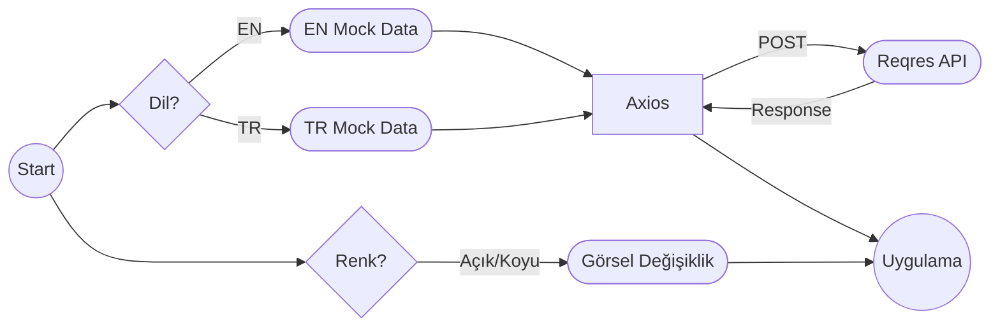

# Sprint Challenge: _Kişisel Web Sitesi_

## Proje Açıklaması

Tebrikler, Frontend konularını tamamladın. Backend konularına geçmeden, şimdiye kadar öğrendiğin her konuyu kullanarak, kişisel web sayfası yapacaksın. Yaptığın siteyi kendi profil sayfanda da yayınlayacaksın. Bu senin Frontend konusunda ne seviyede olduğunu gösterecek.

Workintech programını tamamladığında, görüştüğün şirketler yaptığın bu projeye de bakacaklar. O yüzden **öğrendiğin her konuyu kullanmaya çalışman önemli**. Projeni, tam çalışır durumda, gramer hatası olmayan bir proje yapmanı tavsiye ederiz.

S12 içinde de Workintech eğitmenlerine, adeta bir teknik mülakttaymış gibi, bu projeyi sunmanı istiyoruz. Bu sunumda, _4 dk_ içerisinde, CSS'e döktüğün arayüzü ve de geliştirdiğin Reach JS sistemi anlatacaksın. İlk önce arayüzde nasıl bir kullanıcı deneyimi sunduğunu kısaca özetleyip, sonra altta kodların nasıl çalıştığını, nasıl bir veri akışı kurduğunu, açık bir şekilde ifade edebilmelisin.

> Kısaca: 4 dk içinde, önce arayüzü anlatıp, sonra kodun nasıl
> çalıştığını ifade edebilmelisin. Zaman kullanımı ve sunum tekniğin de değerlendirme kriterlerinde yer alıyor. Öncesinde, kendini videoya çekerek, sunum pratiği yapabilirsin.

Not\* Bu dökümanın en sonunda da, sunumda seni değerlendireceğimiz başlıkları da bulabilirsin.

## Talimatlar

### Görev 1: Proje Kurulumu

- [ ] `npm create vite@latest` komutuyla boş bir çalışma başlatabilirsin. [Dökümantasyon: Scaffolding Your First Vite Project](https://vitejs.dev/guide/#scaffolding-your-first-vite-project)
- [ ] Oluşturulan proje klasörüne gir.
- [ ] `npm` i kullanarak, gerekli gördüğün kütüphaneleri projene ekleyebilirsin. _Örneğin:_
- `axios`
- `toastify`
- `tailwind`
- `cypress.io` v.b.

### Görev 2: UI Tasarımı ve React JS Geliştirmeleri

[Bu bağlantıda](https://www.figma.com/file/YuAwEInBB8GqOO7wNosr5j/s12-design202304?node-id=0%3A1&t=U1HnfQaOkunlvpNb-1) 3 farklı tasarım var. Hangisini beğenirsen onu kullanabilirsin. CSS stillerini ve HTML/JSX iskeletini geliştirirken, tasarımı bire bir yaptığını **emin olana kadar** kesinlikle özelleştirmemeni tavsiye ediyoruz.

- [ ] Tasarımdaki her bir section için ayrı bir component oluşturun.
- [ ] Her component'in style'ını ayarlayın.
- [ ] Verilerinizi kendi oluşturduğunuz verileri statik bir json dosyasından çekin.
- [ ] Dark Mode tasarımı da entegre edin.
- [ ] Türkçe-İngilizce içerik oluşturun.
- [ ] Responsive özelleştirmelerini yapın. Mobil ve tablet gibi farklı cihaz boyutları için, tasarımda biraz değişiklik yapabilirsin. Buralarda insiyatif kullanabilirsin.

#### Önemli Notlar!

- Dil yönetiminde i18n gibi bir paket kullanmanızı ASLA istemiyoruz. useContext veya Redux kullanarak, veri yönetimi, ve görüntüleme katmanının izole olduğu bir proje yapabildiğinizi görmek istiyoruz.
-  Tasarımı birebir uygulamalısın.
  - Resimleri ve projeleri kendi projelerinle güncelleyebilirsin. Yine de kesinlikle **renkler ve yerleşimde** değişiklik istemiyoruz.
  - Sunumdan sonra dilersen sonrasında kendi portföyün için özelleştirebilirsin.
- Axios ile *https://reqres.in/api/workintech* (yereldeki data.js, POST) veya başka bir sahte API servisi ile dış kaynakla iletişim kurabildiğini gösterebilmelisin. Dış servis ile iletişim kurmayı projenin en sonuna atın. Önceliği en düşük kısımlardan biri bu. Daha detaylı dış servis kurmayı ileride öğreneceksiniz.

https://mockapi.io veya benzeri bir servisle, projeniz bitmeden önce zaman kaybedip, asıl yapmanız gerekenleri öncelik sırasına göre yapmayıp, talimat dışına çıkarsanız düşük not alabilirsiniz. Data için reqres.in dışında bir servis kullanmaya zaman harcayanlar genelde yetiştiremiyor. Sunumdan sonra ayrıca isterseniz bakabilirsiniz. 

> Böylece backende geçince de yönetim paneli yazıp, hem kod kalitesi hem yapabildiğiniz her şeyi tek projede birleştirmiş olacaksınız.

### Temsili Veri Akış Diagramı

### Görev 3: Yayına Almak

Projenizi vercel.com veya render.com yayınlayın.

> Öncesinde geliştirdiğiniz bütün projelerin de vercel'deki linklerini
> eklediğinize dikkat edin.